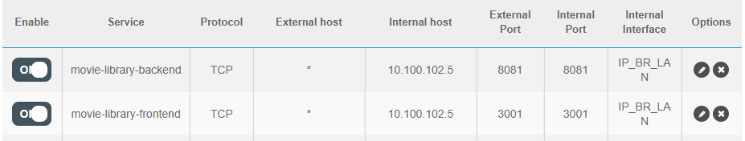

### MAKE SITE ACCESSIBLE FROM OUTSIDE
1. In router set 2 rule in port forwarding:

2. In prod put into file: `axios-movies.js` external ip to backend instead of local ip
Now site is accessible from any place `http://ext-ip:port/movies`